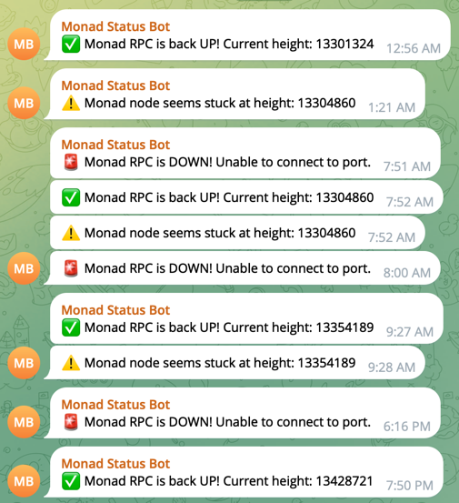

## Monad Sync Status Monitoring via Telegram 

- Telegram-Based Block Height Monitoring tool for `fullnodes` and `validator` nodes
  - Fetches the latest block height from your Monad node
  - Sends it as a Telegram message to dedicated channel
  - Checks the node's sync status automatically
  - No dashboards. No browser needed.
  - Just a clean, systemd or cron-backed heartbeat notification from your node — straight to Telegram.

### 🎯Getting started

- Download the repository
    ```aiignore
    git clone https://github.com/cosmostation/monad-sync-monitoring.git
    ```
- Inside the directory build the binary
    ```aiignore
    # build the binary
    cd monad-sync-monitoring && make build
    ```
- Set the `.env` file
  ```aiignore
  cd monad-sync-monitoring
  mv .env.sample .env
  ```
- Update the `.env` file with Telegram Bot Token and Telegram Private Chat ID 
  ```aiignore
  vim .env
  
  TELEGRAM_TOKEN=804xxxx:AAEymFxxxxxxxxxxxxxxxxxxxxxxxxx
  TELEGRAM_CHAT_ID=-38xxxxxx
  RPC_PORT=8080  # default
  ```
  - Check the guide on how to get the [Telegram Bot Token](https://core.telegram.org/bots/features#creating-a-new-bot) 
  - And how to acuqire the [Telegram Chat ID](https://neliosoftware.com/content/help/how-do-i-get-the-channel-id-in-telegram/)
  

- Create `monad-monitoring.service` file
  ```aiignore
  sudo vim monad-monitoring.service
  
  [Unit]
  Description=Monad Sync Health Checker
  After=network.target
  
  [Service]
  ExecStart=/home/monad/monad-sync-monitoring/monad-monitoring
  WorkingDirectory=/home/monad/monad-sync-monitoring
  User=monad
  Restart=always
  RestartSec=5
  EnvironmentFile=/home/monad/monad-sync-monitoring/.env
  
  [Install]
  WantedBy=multi-user.target
  ```
- Service reload and start
  ```aiignore
  sudo systemctl daemon-reload
  sudo systemctl enable monad-monitoring.service
  sudo systemctl start monad-monitoring.service
  ```

### Expected Outcome

- The following example screenshot shows a Telegram bot called `Monad Status Bot` actively monitoring and reporting the status of a Monad node. The messages are timestamped and use emojis to indicate different statuses.

- 📊Summary of Bot Behavior:
  - ✅UP 
    - Message: Monad RPC is back UP! Current height: `<height>`
    - Emoji: ✅ 
    - Indicates the node is responsive again.

  - ⚠️Stuck 
    - Message: Monad node seems stuck at height: `<height>`
    - Emoji: ⚠️ 
    - Indicates the node is reachable but not advancing in block height.

  - ❌ DOWN 
    - Message: Monad RPC is DOWN! Unable to connect to port. 
    - Emoji: 🛑 (red square with X)
    - Indicates the node is unreachable—possibly network or process failure.

  

### [Medium article](https://medium.com/cosmostation/telegram-based-rpc-sync-monitoring-for-monad-nodes-a4e8f915d588)

Telegram-Based RPC Sync Monitoring for Monad Nodes

-------

### Disclaimer

> THIS SOFTWARE IS PROVIDED BY THE COPYRIGHT HOLDERS AND CONTRIBUTORS “AS IS” AND ANY EXPRESS OR IMPLIED WARRANTIES, INCLUDING, BUT NOT LIMITED TO, THE IMPLIED WARRANTIES OF  
> MERCHANTABILITY AND FITNESS FOR A PARTICULAR PURPOSE ARE DISCLAIMED. IN NO EVENT SHALL THE COPYRIGHT OWNER OR CONTRIBUTORS BE LIABLE FOR ANY DIRECT, INDIRECT, INCIDENTAL, SPECIAL,  
> EXEMPLARY, OR CONSEQUENTIAL DAMAGES (INCLUDING, BUT NOT LIMITED TO, PROCUREMENT OF SUBSTITUTE GOODS OR SERVICES; LOSS OF USE, DATA, OR PROFITS; OR BUSINESS INTERRUPTION) HOWEVER CAUSED  
> AND ON ANY THEORY OF LIABILITY, WHETHER IN CONTRACT, STRICT LIABILITY, OR TORT (INCLUDING NEGLIGENCE OR OTHERWISE) ARISING IN ANY WAY OUT OF THE USE OF THIS SOFTWARE, EVEN IF ADVISED OF  
> THE POSSIBILITY OF SUCH DAMAGE.
